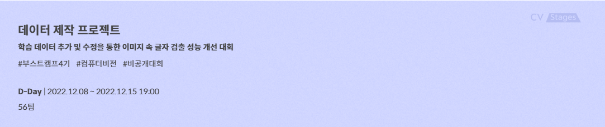
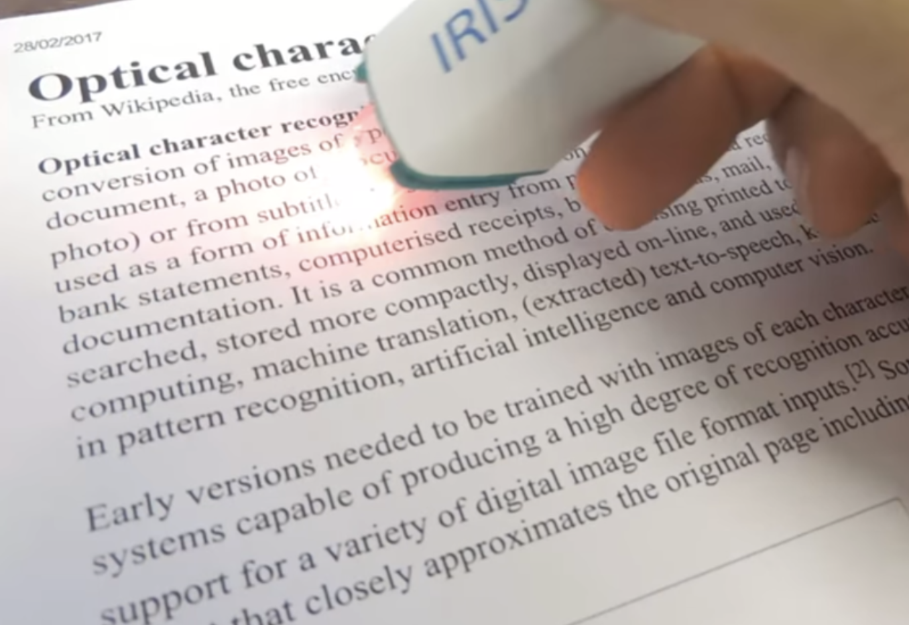
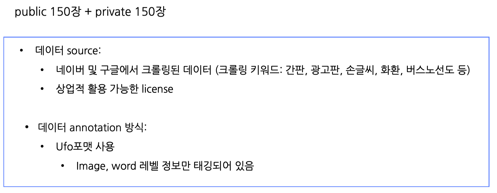
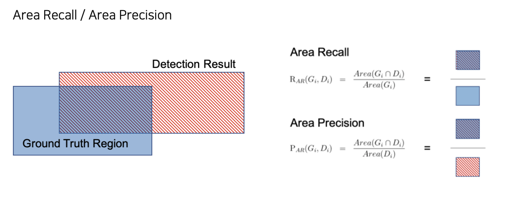
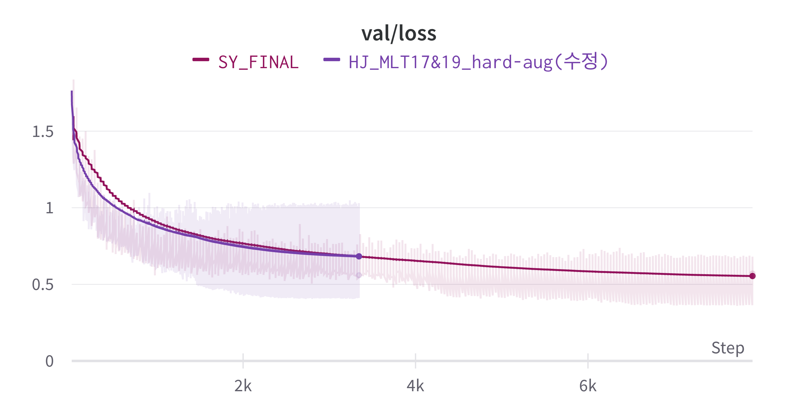

# 📃프로젝트 개요

OCR (Optimal Character Recognition) 기술은 사람이 직접 쓰거나 이미지 속에 있는 문자를 얻은 다음 이를 컴퓨터가 인식할 수 있도록 하는 기술로, 컴퓨터 비전 분야에서 현재 널리 쓰이는 대표적인 기술 중 하나입니다. OCR task는 글자 검출 (text detection), 글자 인식 (text recognition), 정렬기 (Serializer) 등의 모듈로 이루어져 있습니다. 본 대회에서는 제약된 환경에서 '글자 검출' task 만을 해결하게 됩니다.

- 대회의 목표 : 양질의 데이터를 주어진 모델에 제공하여 높은 정확도를 보이도록 학습시키는 것

- 제약사항

  1. 모델 - Text Detector 네트워크 중 하나인 EAST
  2. Loss, 평가지표

- 수정할 수 있는 것

  1. Data - 다양한 데이터를 가져와서 모델에 학습시킨다.
  2. Dataset 코드 - 데이터의 다양성을 위해 agumentation 적용 가능하다.
  3. Train 코드 - validation 코드 추가, 하이퍼파라미터 튜닝 가능
  4. Inference 코드 - TTA적용가능

- 평가 데이터

  

### 평가지표

**DetEval**

이미지 레벨에서 정답 박스가 여러개 존재하고, 예측한 박스가 여러개가 있을 경우, 박스끼리의 다중 매칭을 허용하여 점수를 주는 평가방법 중 하나

1. **모든 정답/예측박스들에 대해서 Area Recall, Area Precision을 미리 계산**

   

# ✏ 프로젝트 수행 절차 및 방법

대회 규칙에 따라서 Model, loss, detect등을 수정할 수 없기 때문에 성능을 향상 시킬 수 있는 방법으로 Data 추가와 augmentation, Hyperparameter를 조정하는 방법으로 진행하였다.

### Dataset

- ICDAR17 Korean
- ICDAR17 English & Korean
- ICDAR19 English & Korean
- AIHub
  - 한국어 글자체 이미지(Text in the Wild)
    - 표지판(500장)
    - 간판(500장)
  - 야외 실제 촬영 한글 이미지
    - 책표지(500장)

### Experiment

- batch_size

  - 12
  - 16
  - 32

- Scheduler

  - StepLR
  - MultiStepLR
  - CosineAnnealingLR
  - CosineAnnealingWarmRestart
  - ReduceLROnPlateau

- Epoch

  - 150
  - 200
  - 300

- Optimizer

  - Adam

- Augmentation

  ColorJitter, ISONoise, RandomGamma, HueSaturationValue, ChannelShuffle, CLAHE, RandomBrightnessContrast, Emboss, Sharpen, Equalize

# 🏆 프로젝트 결과

- loss

  

- score

  

  

# 👨‍👨‍👧‍👦 팀원 소개

|         [황순영](https://github.com/soonyoung-hwang)         |            [서원준](https://github.com/won-joon)             |              [이하정](https://github.com/SS-hj)              |             [김도훈](https://github.com/DHKim95)             |
| :----------------------------------------------------------: | :----------------------------------------------------------: | :----------------------------------------------------------: | :----------------------------------------------------------: |
|  |  |  |  |

